# BEDROT Data Lake - Comprehensive Analysis

*Document Date: 2025-05-30*

## Table of Contents

1. [Executive Summary](#executive-summary)
2. [Architecture Overview](#architecture-overview)
   - [Data Lake Zones](#data-lake-zones)
   - [Data Flow Visualization](#data-flow-visualization)
3. [Technical Implementation](#technical-implementation)
   - [ETL Pipeline Architecture](#etl-pipeline-architecture)
   - [Extraction Components](#extraction-components)
   - [Transformation Components](#transformation-components)
   - [Loading Components](#loading-components)
4. [Project Organization](#project-organization)
   - [Folder Structure](#folder-structure)
   - [Code Patterns](#code-patterns)
   - [Automation Strategy](#automation-strategy)
5. [Data Sources](#data-sources)
   - [DistroKid](#distrokid)
   - [TooLost](#toolost)
   - [Meta Ads](#meta-ads)
   - [TikTok](#tiktok)
   - [Linktree](#linktree)
6. [Operational Considerations](#operational-considerations)
   - [Monitoring and Logging](#monitoring-and-logging)
   - [Data Validation](#data-validation)
   - [Error Handling](#error-handling)
7. [Future Development Recommendations](#future-development-recommendations)
   - [Technical Debt](#technical-debt)
   - [Enhancement Opportunities](#enhancement-opportunities)
   - [Scaling Considerations](#scaling-considerations)
8. [Appendix](#appendix)
   - [Project Timeline](#project-timeline)
   - [Key Contributors](#key-contributors)

## Executive Summary

The BEDROT Data Lake represents a structured approach to data management for BEDROT Productions, with clearly defined zones for data processing, comprehensive automation, and robust data governance. The system ingests data from multiple sources (DistroKid, TooLost, Meta Ads, TikTok, Linktree) through web scrapers and API integrations, transforms it through a series of cleaner scripts, and provides business-ready datasets for analytics and reporting.

Key strengths of the implementation include:
- Well-defined data zones with clear responsibilities
- Automated ETL processes with scheduled execution
- Strong data lineage and auditability
- Modular code organization by data source
- Robust error handling and validation

The system shows continuous improvement, with recent updates focused on enhancing TikTok analytics extraction, refactoring Meta Ads processing, and improving the overall automation workflow.

## Architecture Overview

### Data Lake Zones

The BEDROT Data Lake follows a multi-zone architecture that enforces data governance and provides a clear path from raw data to business-ready insights:

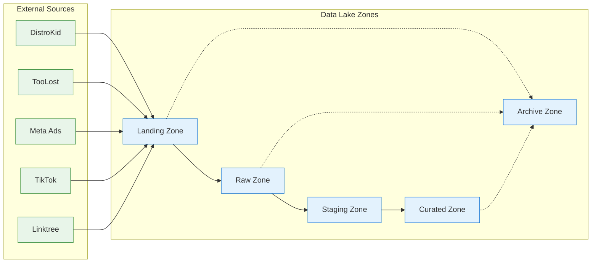

Each zone has a specific purpose in the data lifecycle:

- **Landing Zone**: Initial data ingestion where external data is first collected. This zone is read-only and preserves the original format of the data. Files are often timestamped and never modified after landing.

- **Raw Zone**: Validated source-of-truth zone with immutable, append-only copies of data from the landing zone. No transformations are performed, maintaining full data lineage.

- **Staging Zone**: Where data cleaning, validation, and transformation occur. This is where most of the business logic is applied, joining data sources, and preparing for final consumption.

- **Curated Zone**: Business-ready datasets for analytics, dashboards, and ML. Contains cleaned, aggregated, and enriched data with stable schemas and documentation.

- **Archive Zone**: Long-term storage for datasets no longer actively used, ensuring historical data is preserved for compliance and future analysis.

### Data Flow Visualization

The overall data flow through the system follows a clear path with well-defined processing steps:

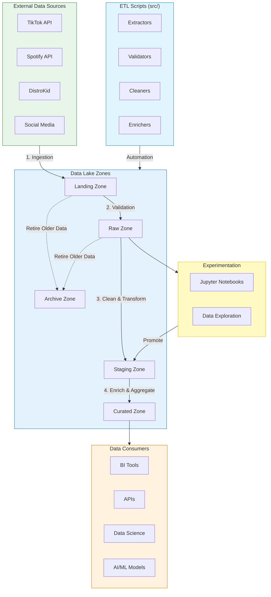

## Technical Implementation

### ETL Pipeline Architecture

The ETL pipeline follows a modular architecture organized by data source, with clear separation between extraction, transformation, and loading components:

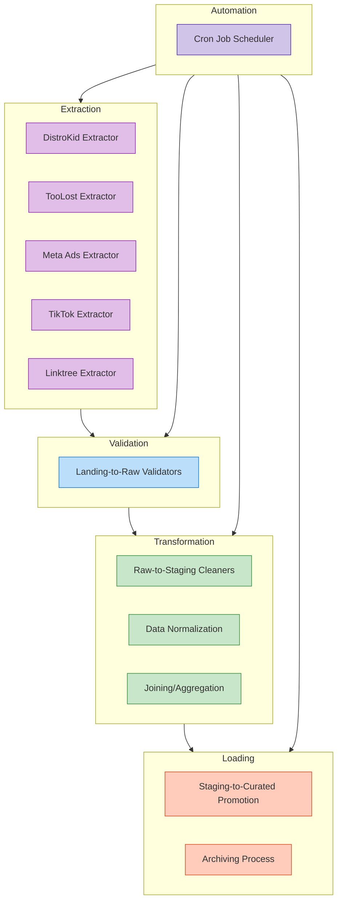

### Extraction Components

Extraction scripts are primarily implemented using Playwright for web scraping, with specialized modules for each data source:

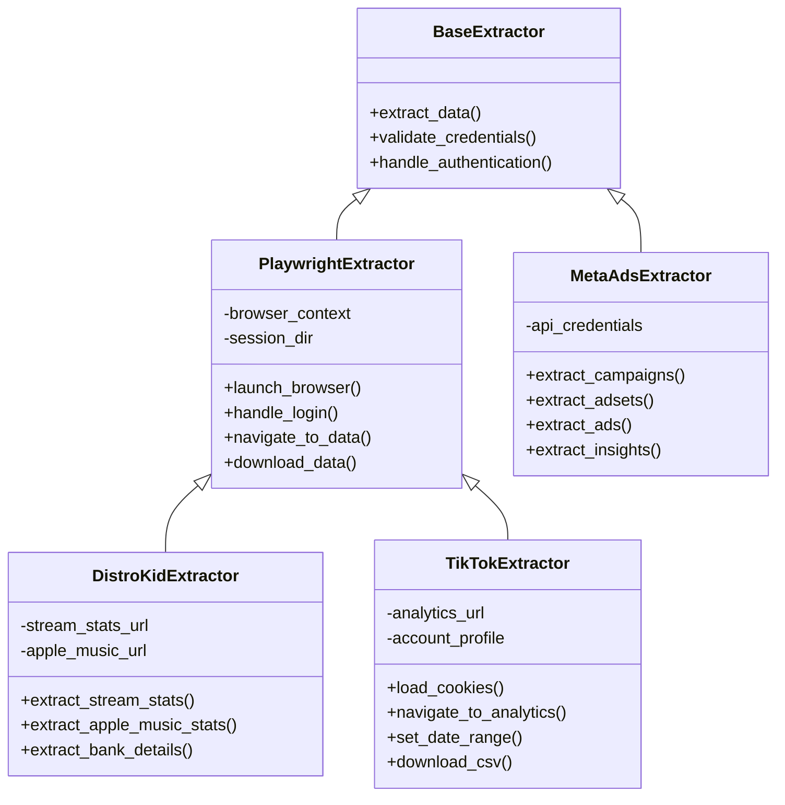

### Transformation Components

The transformation pipeline follows a consistent pattern across data sources with three main stages:

```mermaid
graph LR
    subgraph Landing-to-Raw["Landing to Raw"]
        L2R1[Validation]
        L2R2[Structure Check]
        L2R3[Copy to Raw]
    end

    subgraph Raw-to-Staging["Raw to Staging"]
        R2S1[Parse & Clean]
        R2S2[Type Conversion]
        R2S3[Deduplication]
        R2S4[Missing Value Handling]
    end

    subgraph Staging-to-Curated["Staging to Curated"]
        S2C1[Business Logic]
        S2C2[Aggregation]
        S2C3[Enrichment]
        S2C4[Archiving]
    end

    Landing-to-Raw --> Raw-to-Staging
    Raw-to-Staging --> Staging-to-Curated

    classDef l2r fill:#bbdefb,stroke:#1976d2
    classDef r2s fill:#c8e6c9,stroke:#388e3c
    classDef s2c fill:#ffccbc,stroke:#e64a19
    
    class L2R1,L2R2,L2R3 l2r
    class R2S1,R2S2,R2S3,R2S4 r2s
    class S2C1,S2C2,S2C3,S2C4 s2c
```

Each data source implements these transformations with specialized cleaner scripts that follow a consistent pattern but address source-specific requirements.

## Project Organization

### Folder Structure

The project follows a well-organized folder structure that separates concerns and enforces data governance:

```mermaid
graph TD
    Root["BEDROT_DATA_LAKE/"] --> Agent[".agent/"]
    Root --> Archive["archive/"]
    Root --> Changelog["changelog.md"]
    Root --> Cronjob["cronjob/"]
    Root --> Curated["curated/"]
    Root --> DataFlow["data_lake_flow.dot"]
    Root --> Docker["docker-compose.yml"]
    Root --> Images["image.png, image.svg"]
    Root --> Knowledge["knowledge/"]
    Root --> Landing["landing/"]
    Root --> MinIO["minio/"]
    Root --> Raw["raw/"]
    Root --> Requirements["requirements.txt"]
    Root --> Sandbox["sandbox/"]
    Root --> Src["src/"]
    Root --> Staging["staging/"]
    
    Src --> SrcDK["distrokid/"]
    Src --> SrcLT["linktree/"]
    Src --> SrcMA["metaads/"]
    Src --> SrcTK["tiktok/"]
    Src --> SrcTL["toolost/"]
    
    SrcDK --> SrcDKE["extractors/"]
    SrcDK --> SrcDKC["cleaners/"]
    
    SrcMA --> SrcMAE["extractors/"]
    SrcMA --> SrcMAC["cleaners/"]
    
    Cronjob --> CronBat["run_datalake_cron.bat"]
    Cronjob --> CronNoEx["run_datalake_cron_no_extractors.bat"]
    Cronjob --> CronGen["generate_no_extractors_cron.py"]
    
    classDef zones fill:#e3f2fd,stroke:#1976d2
    classDef code fill:#e1f5fe,stroke:#0288d1
    classDef docs fill:#f3e5f5,stroke:#8e24aa
    classDef config fill:#fff3e0,stroke:#f57c00
    
    class Archive,Landing,Raw,Staging,Curated zones
    class Src,SrcDK,SrcLT,SrcMA,SrcTK,SrcTL,SrcDKE,SrcDKC,SrcMAE,SrcMAC code
    class Changelog,DataFlow,Images,Knowledge docs
    class Cronjob,CronBat,CronNoEx,CronGen,Docker,Requirements,Agent config
```

### Code Patterns

The codebase follows several consistent patterns:

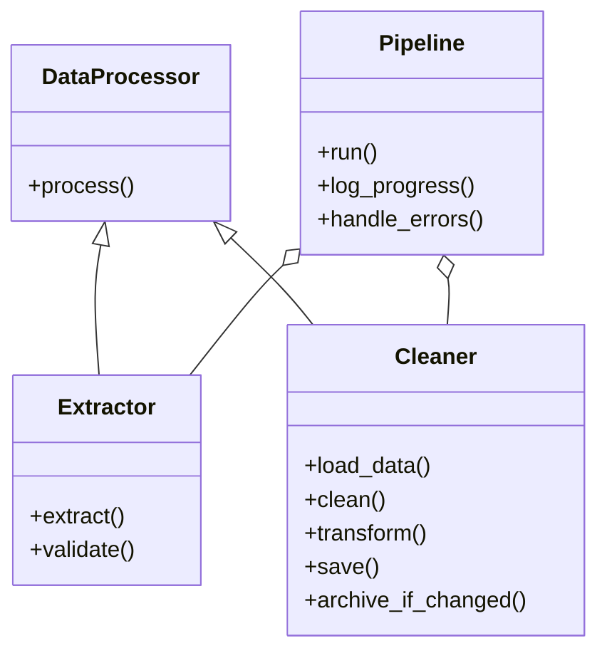

Key patterns include:
1. **Modular Organization**: Code is organized by data source and processing stage
2. **Clear Separation of Concerns**: Extractors, validators, and cleaners have distinct responsibilities
3. **Consistent File Naming**: Files follow a predictable naming pattern like `{source}_{stage}.py`
4. **Path Abstraction**: All scripts use environment variables for paths to avoid hardcoding
5. **Idempotent Processing**: Scripts can be run multiple times without side effects
6. **Archiving Before Changes**: All curated data is archived before being replaced
7. **Hashing for Change Detection**: File hashes are used to detect changes and avoid unnecessary updates

### Automation Strategy

The automation strategy centers around Windows Task Scheduler and batch files:

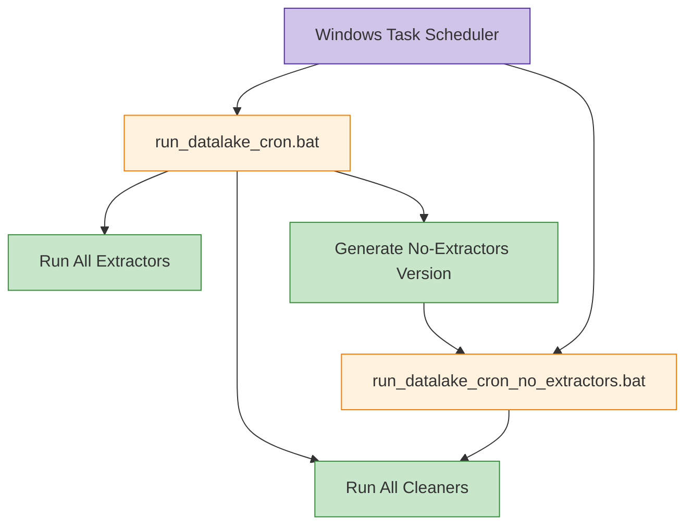

The automation approach is:
1. **Centralized Maintenance**: Only the master cron job file is manually edited
2. **Automatic Generation**: Secondary variants are generated automatically
3. **Modular Processing**: The system automatically discovers and runs all extractors and cleaners
4. **Error Handling**: Any script failure stops the batch to prevent corrupted data
5. **Regular Scheduling**: Jobs run on Monday, Wednesday, and Friday

## Data Sources

### DistroKid

DistroKid data is extracted using Playwright-based web scraping that navigates to the dashboard, extracts streaming data and bank details, and processes them through the ETL pipeline:

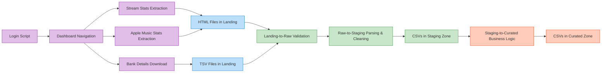

### TikTok

TikTok analytics are extracted using account-specific Playwright automation:

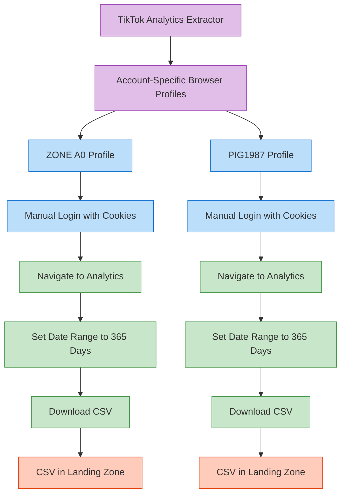

### Meta Ads

Meta Ads data is extracted from the Facebook Marketing API and processed through the pipeline:

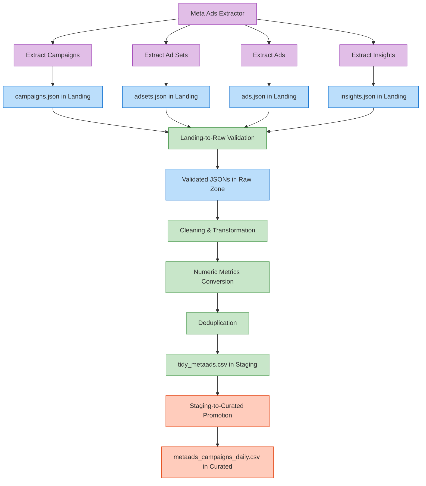

## Operational Considerations

### Monitoring and Logging

The system implements comprehensive logging with:

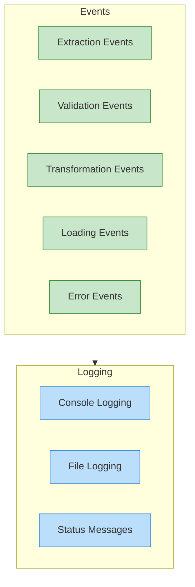

### Data Validation

The data validation approach includes:

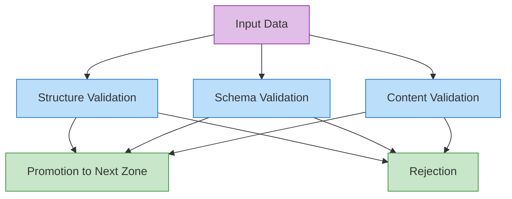

## Future Development Recommendations

### Technical Debt

Areas requiring attention:

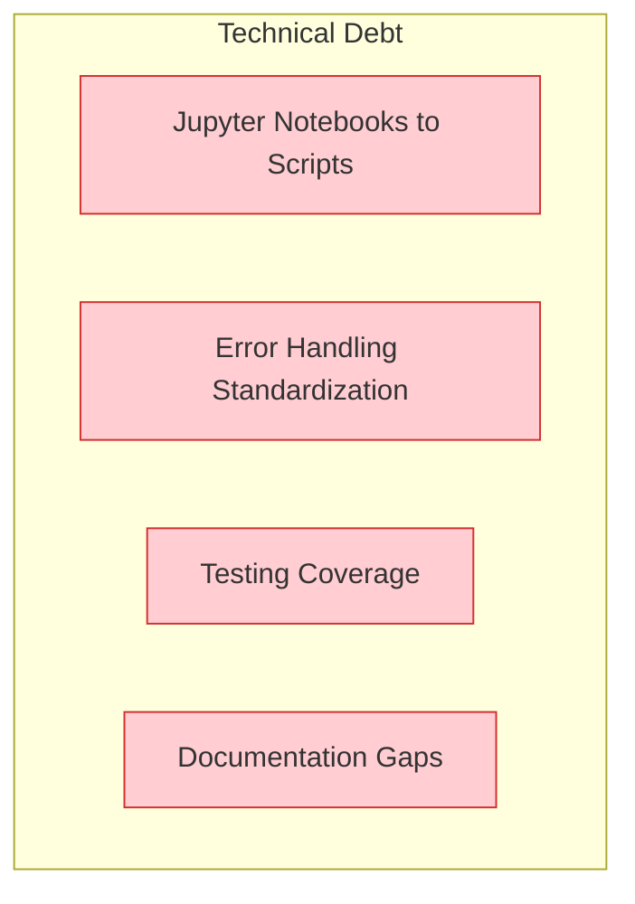

### Enhancement Opportunities

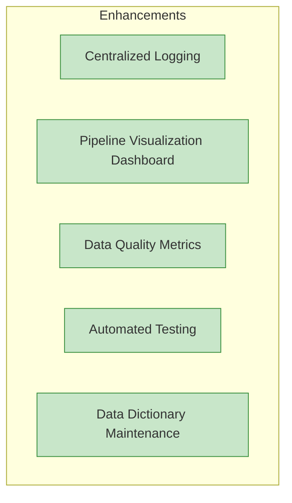

### Scaling Considerations

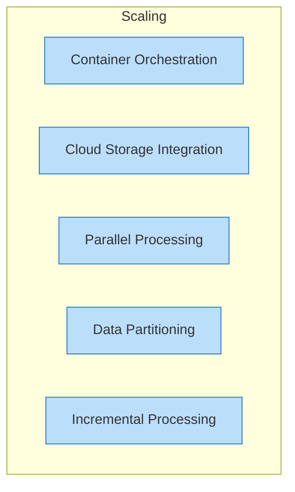

## Appendix

### Project Timeline

Key milestones from the changelog:

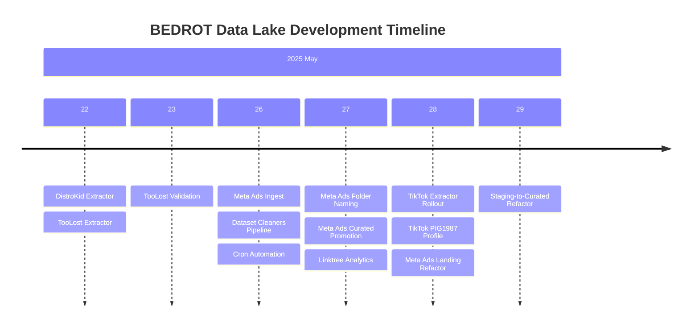

### Key Contributors

The project shows evidence of collaboration across multiple roles:

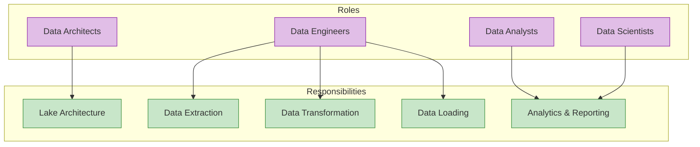

---

*This document was generated on 2025-05-30 by CASCADE for BEDROT Productions.*
