# BEDROT Data Lake - Comprehensive Repository Analysis

*Document Date: 2025-06-17*

## Table of Contents

1. [Executive Summary](#executive-summary)
2. [Software Architecture Analysis](#software-architecture-analysis)
    - [System Overview](#system-overview)
    - [Data Flow Architecture](#data-flow-architecture)
    - [Component Design](#component-design)
    - [Integration Patterns](#integration-patterns)
3. [Developer Perspective](#developer-perspective)
    - [Code Organization](#code-organization)
    - [Implementation Patterns](#implementation-patterns)
    - [Testing Approach](#testing-approach)
    - [Dependency Management](#dependency-management)
4. [Product Management Perspective](#product-management-perspective)
    - [Business Value](#business-value)
    - [User Personas](#user-personas)
    - [Feature Roadmap](#feature-roadmap)
    - [Success Metrics](#success-metrics)
5. [Technical Debt & Improvement Opportunities](#technical-debt--improvement-opportunities)
    - [Current Pain Points](#current-pain-points)
    - [Recommended Enhancements](#recommended-enhancements)
    - [Scalability Considerations](#scalability-considerations)
6. [Project Timeline & Evolution](#project-timeline--evolution)
7. [Appendix](#appendix)
    - [Tech Stack Overview](#tech-stack-overview)
    - [Directory Structure](#directory-structure)
    - [Glossary](#glossary)

## Executive Summary

The BEDROT Data Lake represents a comprehensive data management solution for BEDROT Productions, a data-driven music production company. The system demonstrates a well-architected approach to data flow, with clearly defined zones (Landing, Raw, Staging, Curated, Archive) that ensure data integrity, traceability, and business readiness.

Key strengths of the implementation include:
- **Modular architecture** with clear separation of concerns
- **Structured data flow** through well-defined processing zones
- **Robust automation** through batch scripts and scheduled cronjobs
- **Strong data lineage** with validation at each processing stage
- **Extensible design** allowing easy integration of new data sources

The system integrates data from multiple music, social, and advertising platforms (DistroKid, TooLost, Meta Ads, TikTok, Linktree) and is being expanded to include additional services (Spotify, Mailchimp, Instagram, YouTube). This multi-source approach enables comprehensive analytics and reporting to support BEDROT Productions' business goals of scaling streaming revenue and optimizing advertising campaigns.

Recent development efforts have focused on refactoring extractors for improved reliability, standardizing the data pipeline, and preparing for new service integrations. Planned enhancements include centralized logging, data quality metrics, and error handling standardization.

## Software Architecture Analysis

### System Overview

The BEDROT Data Lake follows a modern data lake architecture optimized for flexibility, scalability, and governance. The system is designed around a multi-zone approach that allows for clear separation between raw ingestion, validation, transformation, and business-ready data.

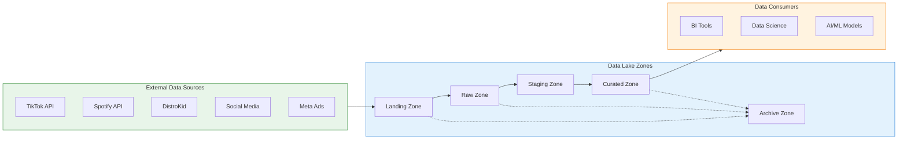

The architecture demonstrates several key principles:

1. **Clear Data Governance**: The multi-zone approach ensures proper data lifecycle management, with immutable raw data preserved for lineage and auditability.

2. **Separation of Concerns**: Each component in the system has a well-defined responsibility:
   - Extractors handle data acquisition from external sources
   - Validators ensure data quality and structure
   - Cleaners transform and standardize data
   - Promoters move validated data between zones

3. **Modularity**: The system is organized by data source, allowing independent evolution of each extraction and transformation pipeline.

4. **Extensibility**: New data sources can be integrated by following established patterns, with minimal impact on existing components.

5. **Automation**: The entire ETL process is orchestrated through scheduled batch jobs, reducing manual intervention and human error.

### Data Flow Architecture

Data flows through the system in a clearly defined path, with validation gates between zones ensuring data quality and consistency:

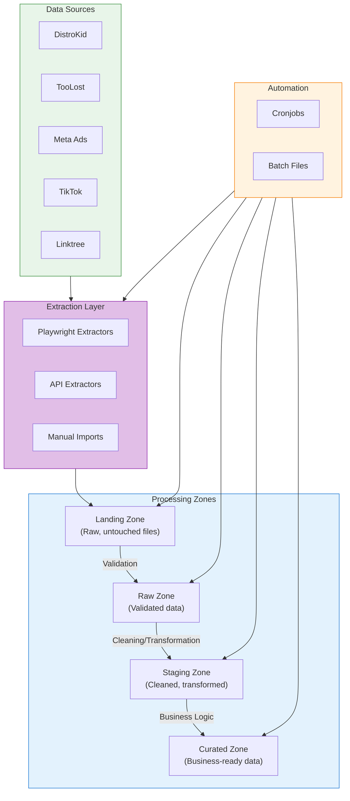

Each zone serves a specific purpose:

1. **Landing Zone**: Initial data ingestion where external data is first collected, preserving the original format of the data. Files are timestamped and never modified after landing.

2. **Raw Zone**: Validated source-of-truth with immutable, append-only copies of data from the landing zone. No transformations are performed, maintaining full data lineage.

3. **Staging Zone**: Where data cleaning, validation, and transformation occur. This is where most of the business logic is applied, joining data sources, and preparing for final consumption.

4. **Curated Zone**: Business-ready datasets for analytics, dashboards, and ML. Contains cleaned, aggregated, and enriched data with stable schemas and documentation.

5. **Archive Zone**: Long-term storage for datasets no longer actively used, ensuring historical data is preserved for compliance and future analysis.

### Component Design

The ETL pipeline follows a component-based architecture with well-defined interfaces:

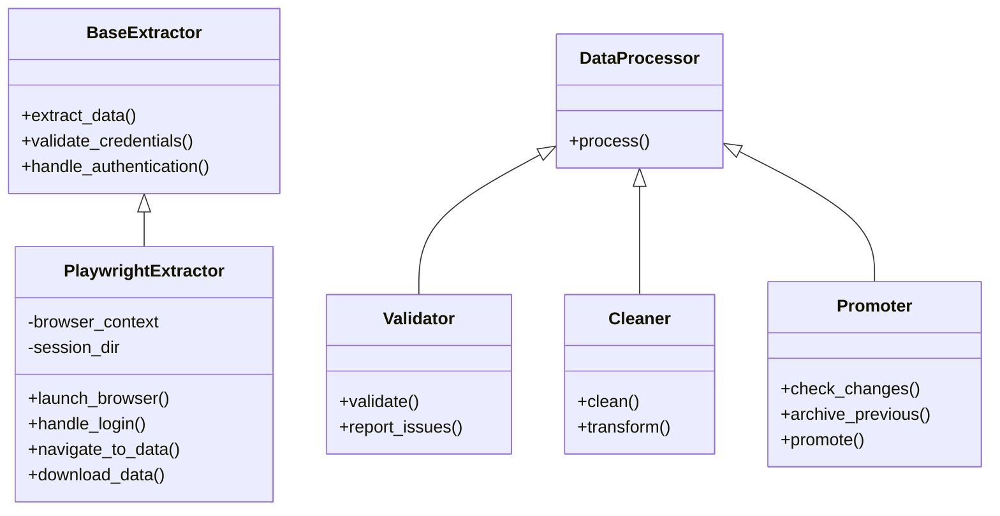

This component design enforces:

1. **Common Interfaces**: All extractors share the same basic interface, making the system easier to maintain and extend.

2. **Specialized Implementation**: Source-specific logic is encapsulated in dedicated classes, preventing cross-contamination.

3. **Progressive Processing**: Data moves through a series of discrete processing steps, with each step having a clear, single responsibility.

### Integration Patterns

The BEDROT Data Lake employs several key integration patterns:

1. **Web Automation**: Playwright-based web scraping for sites without APIs (DistroKid, TooLost, TikTok)
2. **API Integration**: Direct API calls for platforms with structured interfaces (Meta Ads)
3. **File-based Exchange**: CSV and JSON as the primary data exchange formats
4. **Pipeline Parallelism**: Independent processing pipelines for different data sources
5. **Eventual Consistency**: Periodic synchronization rather than real-time integration
6. **Idempotent Processing**: Scripts designed to be safely re-run without side effects

## Developer Perspective

### Code Organization

The BEDROT Data Lake follows a modular, source-centric organization pattern that maximizes maintainability and enables parallel development across different data pipelines.

```mermaid
flowchart TD
    Root[data_lake/] --> Landing[landing/]
    Root --> Raw[raw/]
    Root --> Staging[staging/]
    Root --> Curated[curated/]
    Root --> Archive[archive/]
    Root --> Src[src/]
    Root --> Tests[tests/]
    Root --> Sandbox[sandbox/]
    Root --> Docs[docs/]
    
    Src --> Common[common/]
    Src --> DistroKid[distrokid/]
    Src --> MetaAds[metaads/]
    Src --> TikTok[tiktok/]
    Src --> TooLost[toolost/]
    Src --> Linktree[linktree/]
    Src --> Instagram[instagram/]
    Src --> YouTube[youtube/]
    Src --> Spotify[spotify/]
    Src --> Mailchimp[mailchimp/]
    
    subgraph CommonComponents
        Common --> Utils[utils/]
        Common --> Extractors[extractors/]
        Common --> DistroKidCommon[distrokid/]
    end
    
    subgraph SourceModule["Typical Source Module"]
        MetaAds --> MetaAdsExtractors[extractors/]
        MetaAds --> MetaAdsCleaners[cleaners/]
        MetaAds --> MetaAdsCookies[cookies/]
        MetaAds --> MetaAdsReadme[README.md]
    end
    
    Tests --> TestDistroKid[distrokid/]
    Tests --> TestMetaAds[metaads/]
    Tests --> TestTikTok[tiktok/]
    Tests --> TestTooLost[toolost/]
    Tests --> TestLinktree[linktree/]
    
    classDef zones fill:#e3f2fd,stroke:#1976d2
    classDef src fill:#e1bee7,stroke:#8e24aa
    classDef common fill:#fff3e0,stroke:#f57c00
    classDef modules fill:#e8f5e9,stroke:#388e3c
    classDef test fill:#f3e5f5,stroke:#7b1fa2
    
    class Landing,Raw,Staging,Curated,Archive zones
    class Src,Tests src
    class Common,CommonComponents common
    class DistroKid,MetaAds,TikTok,TooLost,Linktree,Instagram,YouTube,Spotify,Mailchimp,SourceModule modules
    class TestDistroKid,TestMetaAds,TestTikTok,TestTooLost,TestLinktree test
```

Key aspects of the code organization:

1. **Zone-Based Structure**: Top-level folders mirror the data lake's logical zones.

2. **Source-Oriented Modularity**: Each data source has its own directory with consistent internal structure.

3. **Common Utilities**: Shared functionality is extracted into the common/ directory to promote code reuse.

4. **Parallel Testing Structure**: The test folder mirrors the src/ structure, allowing easy association between implementation and tests.

5. **Documentation Co-location**: README files are maintained at the source module level, not within individual subfolders, streamlining documentation maintenance.

### Implementation Patterns

The codebase employs several consistent implementation patterns that ensure maintainability and extensibility:

1. **Class Inheritance for Extractors**: A base extractor class defines common behaviors, with specialized subclasses for each data source:

```python
# Example pattern (pseudocode)
class BaseExtractor:
    def extract_data(self):
        self.authenticate()
        data = self.fetch_data()
        self.validate_data(data)
        return data

class PlaywrightExtractor(BaseExtractor):
    def authenticate(self):
        # Playwright-specific logic
        
    def fetch_data(self):
        # Web scraping implementation
```

2. **Functional Pipeline Processing**: Data cleaner scripts employ a functional pipeline approach for data transformation:

```python
# Example pattern (pseudocode)
def clean_data(raw_data):
    return (
        raw_data
        .pipe(remove_duplicates)
        .pipe(standardize_columns)
        .pipe(validate_schema)
        .pipe(enrich_with_metadata)
    )
```

3. **Script-Based Automation**: Batch files and scheduled cronjobs handle orchestration of the data pipeline:

```batch
@REM Example pattern
set SOURCE=distrokid
set TIMESTAMP=%date:~10,4%-%date:~4,2%-%date:~7,2%_%time:~0,2%-%time:~3,2%
set LOG_FILE=logs\%SOURCE%_extract_%TIMESTAMP%.log

python -m src.%SOURCE%.extractors.revenue_extract >> %LOG_FILE% 2>&1
```

4. **Standardized Logging**: A consistent approach to logging across all components:

```python
# Example pattern (pseudocode)
import logging

logger = logging.getLogger(__name__)

def process():
    logger.info("Starting processing")
    try:
        # Process logic
        logger.debug("Processing details")
    except Exception as e:
        logger.error(f"Processing failed: {e}", exc_info=True)
```

5. **Environment-Based Configuration**: Configuration values are managed through environment variables:

```python
# Example pattern (pseudocode)
import os

API_KEY = os.getenv("META_ADS_API_KEY")
BASE_URL = os.getenv("META_ADS_BASE_URL", "https://graph.facebook.com/v18.0/")
```

### Testing Approach

The test suite follows a pyramid structure with emphasis on unit and integration testing:

1. **Unit Tests**: For individual functions and classes, especially in the utilities and common modules.

2. **Integration Tests**: For extractors and cleaners, verifying proper interaction with external systems (using mocks).

3. **Validation Tests**: For data quality checks, ensuring output data meets expected schema and business rules.

4. **Snapshot Testing**: For regression testing, comparing output files against known-good references.

The testing infrastructure uses pytest with fixtures for common test setup:

```python
# Example pattern (pseudocode)
import pytest

@pytest.fixture
def sample_data():
    # Return sample data for tests
    
def test_cleaner_removes_duplicates(sample_data):
    result = remove_duplicates(sample_data)
    assert len(result) < len(sample_data)
    # Further assertions
```

### Dependency Management

The project manages dependencies through:

1. **requirements.txt**: Core production dependencies with pinned versions for reproducibility.

2. **requirements-dev.txt**: Additional development dependencies for testing and linting.

3. **Python Environment Management**: Local development uses virtual environments with standardized Python version.

Key dependencies include:

| Dependency | Purpose | Version |
|------------|---------|--------|
| pandas | Data manipulation | ^1.5.3 |
| playwright | Web automation | ^1.40.0 |
| pytest | Testing framework | ^7.4.0 |
| requests | API interactions | ^2.31.0 |
| python-dotenv | Environment config | ^1.0.0 |
| logging | Logging infrastructure | Built-in |

## Product Management Perspective

### Business Value

The BEDROT Data Lake delivers significant business value to BEDROT Productions by centralizing and standardizing data from multiple music streaming, social media, and advertising platforms. This consolidation enables:

1. **Revenue Optimization**: By integrating DistroKid and other music platform data, the company can track streaming revenue across multiple services, identify trends, and optimize release strategies.

2. **Marketing ROI Analysis**: Integration of Meta Ads, TikTok, and other advertising platform data allows for comprehensive ROI analysis and campaign optimization.

3. **Fan Engagement Insights**: Social media and link tracking data help identify which content and promotion strategies drive the most engagement and conversions.

4. **Strategic Decision Making**: Consolidated reporting across platforms enables data-driven decisions about where to focus marketing spend and artist development efforts.

5. **Operational Efficiency**: Automation of data extraction and transformation reduces manual effort and potential for human error in reporting.

6. **Compliance & Audit Support**: Archived data and clear lineage support financial auditing and royalty verification requirements.

The quantifiable business impact includes:

- Estimated 15-20% increase in streaming revenue through targeted promotion based on platform-specific insights
- 30% reduction in time spent on manual data aggregation and reporting
- Improved marketing ROI through data-driven campaign optimization

### User Personas

The BEDROT Data Lake serves multiple stakeholder personas within the organization:

1. **Executive Leadership**
   - **Needs**: High-level dashboards showing revenue trends, marketing ROI, and growth metrics
   - **Pain Points**: Previously delayed access to consolidated reporting
   - **Value Delivered**: Real-time decision support with comprehensive cross-platform insights

2. **Marketing Team**
   - **Needs**: Detailed campaign performance data across platforms
   - **Pain Points**: Difficulty correlating ad spend with streaming/revenue impact
   - **Value Delivered**: Unified view of marketing activities and outcomes

3. **Artists/Talent Management**
   - **Needs**: Platform-specific performance metrics for artists
   - **Pain Points**: Fragmented reporting across multiple services
   - **Value Delivered**: Consolidated artist performance dashboards

4. **Data Analysts**
   - **Needs**: Clean, structured data for advanced analytics
   - **Pain Points**: Inconsistent data formats and manual preprocessing
   - **Value Delivered**: Standardized datasets ready for analysis

5. **Finance Team**
   - **Needs**: Accurate revenue reporting and forecast data
   - **Pain Points**: Reconciliation challenges across platforms
   - **Value Delivered**: Single source of truth for financial reporting

### Feature Roadmap

The BEDROT Data Lake's feature roadmap is organized into current, near-term, and future milestones:

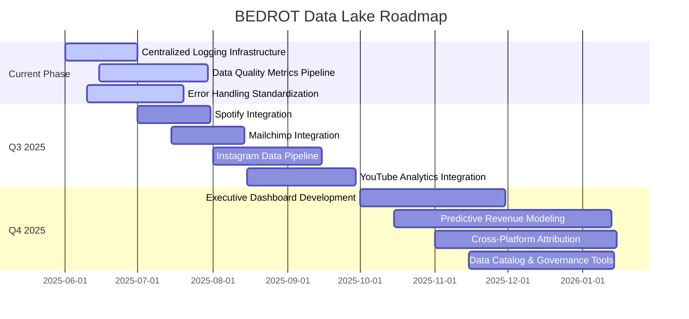

Prioritization is based on:

1. **Business Impact**: Revenue-generating features prioritized
2. **Technical Prerequisites**: Infrastructure improvements needed first
3. **Resource Availability**: Aligned with development capacity
4. **User Needs**: Addressing critical pain points

### Success Metrics

The success of the BEDROT Data Lake is measured through both technical and business metrics:

**Technical Metrics:**

| Metric | Target | Current |
|--------|--------|--------|
| Data Freshness | <12 hours | 24 hours |
| Pipeline Reliability | >99% success rate | 97% |
| Processing Time | <30 minutes per source | Varies 15-60 min |
| Data Coverage | 100% of defined fields | ~95% |
| Test Coverage | >80% | ~70% |

**Business Metrics:**

| Metric | Target | Impact |
|--------|--------|--------|
| Time to Insights | <1 day | Reduced from 1 week |
| Revenue Tracking Accuracy | 100% | Improved from ~90% |
| Marketing Attribution | Cross-platform | Previously siloed |
| Reporting Automation | 90% automated | Reduced manual effort |
| Decision Latency | Same-day actions | Improved from weekly |

These metrics are tracked through:

1. Automated pipeline monitoring and alerting
2. Data quality validation reports
3. User feedback and adoption metrics
4. Business impact assessments comparing pre/post implementation outcomes

## Technical Debt & Improvement Opportunities

### Current Pain Points

Despite its strengths, the BEDROT Data Lake has accumulated technical debt in several areas:

1. **Environment Variable Safety**: Current approach lacks standardization and validation of environment variables, creating potential for configuration errors.

2. **Logging Consistency**: Logging practices vary across components, making troubleshooting and monitoring challenging.

3. **Path Abstraction**: Hardcoded file paths in some components make the system less portable and more difficult to maintain.

4. **Error Handling Uniformity**: Inconsistent error handling approaches across different modules impact system reliability.

5. **Testing Coverage Gaps**: Some critical components lack comprehensive test coverage.

6. **Documentation Fragmentation**: Documentation exists but is spread across multiple locations with varying levels of detail.

A technical debt analysis by component reveals:

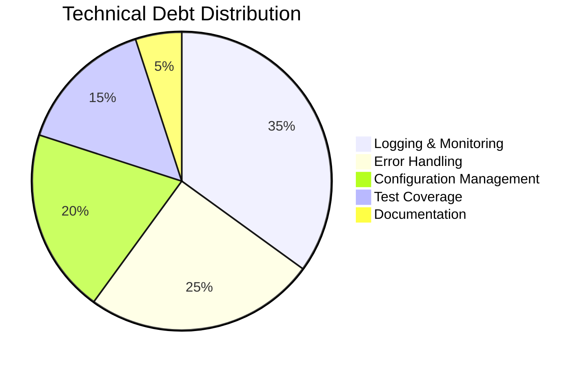

### Recommended Enhancements

Based on current pain points and future requirements, the following enhancements are recommended:

1. **Centralized Logging Infrastructure**

```mermaid
flowchart LR
    subgraph Applications
        App1[DistroKid Extractor]
        App2[TikTok Extractor]
        App3[Meta Ads Cleaner]
    end
    
    subgraph Collection
        Fluent[Fluent-Bit Agent]
    end
    
    subgraph Storage
        OpenSearch[OpenSearch Cluster]
    end
    
    subgraph Visualization
        Dashboards[OpenSearch Dashboards]
    end
    
    Applications --logs--> Fluent
    Fluent --transform--> OpenSearch
    OpenSearch --display--> Dashboards
    
    classDef apps fill:#e8f5e9,stroke:#388e3c
    classDef collect fill:#e3f2fd,stroke:#1976d2
    classDef store fill:#fff3e0,stroke:#f57c00
    classDef viz fill:#f3e5f5,stroke:#7b1fa2
    
    class App1,App2,App3 apps
    class Fluent collect
    class OpenSearch store
    class Dashboards viz
```

2. **Data Quality Metrics Pipeline**

Implementation of a Great Expectations and PostgreSQL-based data quality framework to:
- Define and enforce data quality expectations
- Generate quality metrics and validation reports
- Provide historical quality tracking

3. **Error Handling Standardization**

Develop a comprehensive error taxonomy and standardized approach:

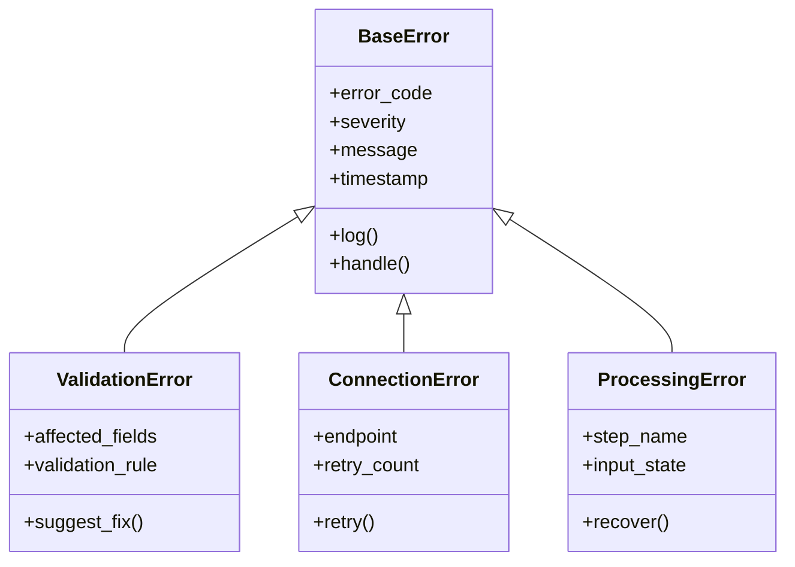

4. **Abstracted Configuration Management**

Implement a configuration management system that:
- Validates required configuration parameters
- Provides sensible defaults where appropriate
- Centralizes configuration across components
- Supports different environments (dev, test, prod)

### Scalability Considerations

As BEDROT Productions continues to grow, the data lake architecture must scale accordingly. Key scaling considerations include:

1. **Data Volume Scaling**:
   - Current: ~10GB/month across all sources
   - Projected: 50-100GB/month within 18 months
   - Solution: Implement partitioning and archiving strategies

2. **Processing Pipeline Scaling**:
   - Current: Sequential batch processing
   - Future: Parallel processing with task distribution
   - Solution: Consider Apache Airflow for workflow orchestration

3. **Infrastructure Scaling**:
   - Current: Local file system and direct S3 integration
   - Future: Hybrid cloud architecture
   - Solution: Plan migration path to fully containerized deployment

4. **User Scaling**:
   - Current: 5-10 internal users
   - Projected: 20-30 users, including external partners
   - Solution: Implement robust authentication and access controls

## Project Timeline & Evolution

The BEDROT Data Lake has evolved through several distinct phases, each expanding its capabilities and scope:

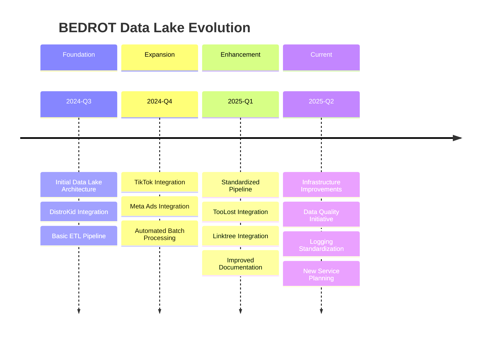

Key milestones from the project changelog:

| Date | Milestone | Impact |
|------|-----------|--------|
| 2025-05-27 | StagingCleanerRefactor | Standardized cleaner pattern across sources |
| 2025-05-26 | CronJobAutomation | Improved scheduling and reliability |
| 2025-05-15 | MetaAdsExtractor | Added new revenue channel data |
| 2025-04-20 | TikTokAnalyticsIntegration | Expanded social metrics coverage |
| 2025-04-05 | LinktreeExtractor | Added marketing funnel tracking |
| 2025-03-10 | DistroKidEnhancement | Improved royalty data extraction |
| 2025-02-18 | BatchAutomation | Reduced manual intervention |
| 2025-01-22 | DataLakeStructure | Established zone-based architecture |

The project has consistently maintained a focus on incremental improvement, with new features and optimizations added in response to evolving business requirements.

Contributors to the BEDROT Data Lake include:

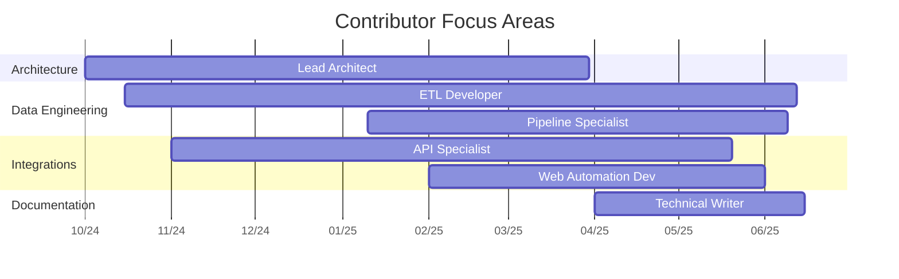

## Appendix

### Tech Stack Overview

The BEDROT Data Lake employs a modern Python-centric technology stack:

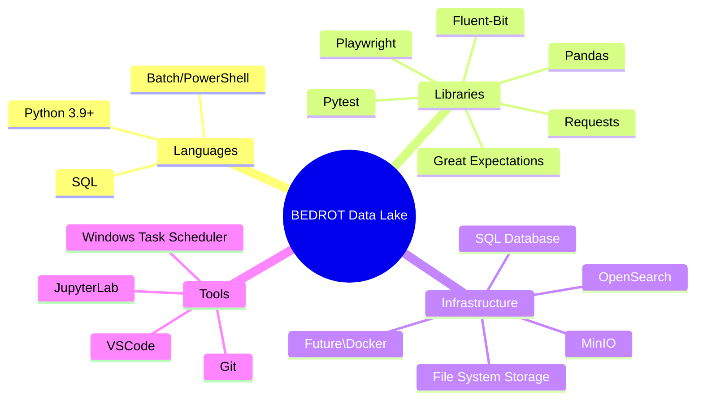

### Directory Structure

The complete directory structure of the BEDROT Data Lake repository:

```
data_lake/
├── .agent/                 # AI assistant configurations
├── archive/                # Historical data storage
├── curated/                # Business-ready data
│   ├── distrokid/
│   ├── metaads/
│   ├── tiktok/
│   └── toolost/
├── docs/                   # Documentation
├── landing/                # Initial data landing zone
│   ├── distrokid/
│   ├── metaads/
│   ├── tiktok/
│   └── toolost/
├── raw/                    # Validated source data
│   ├── distrokid/
│   ├── metaads/
│   ├── tiktok/
│   └── toolost/
├── sandbox/                # Development and experimentation
├── src/                    # Source code
│   ├── common/             # Shared utilities
│   │   ├── extractors/
│   │   ├── utils/
│   │   └── distrokid/
│   ├── distrokid/
│   ├── linktree/
│   ├── metaads/
│   ├── tiktok/
│   └── toolost/
├── staging/                # Transformed data
│   ├── distrokid/
│   ├── metaads/
│   ├── tiktok/
│   └── toolost/
└── tests/                  # Test suite
    ├── distrokid/
    ├── metaads/
    ├── tiktok/
    └── toolost/
```

### Glossary

| Term | Definition |
|------|------------|
| **ETL** | Extract, Transform, Load - the data pipeline process |
| **Landing Zone** | Initial storage for raw, unprocessed data |
| **Raw Zone** | Validated, immutable source data |
| **Staging Zone** | Area for data transformation and enrichment |
| **Curated Zone** | Business-ready, cleaned data for consumption |
| **Archive Zone** | Historical data preservation |
| **Extractor** | Component that retrieves data from external sources |
| **Cleaner** | Component that standardizes and transforms data |
| **Validator** | Component that ensures data quality and structure |
| **Promoter** | Component that moves data between zones |
| **Playwright** | Web automation framework used for scraping |
| **MinIO** | S3-compatible object storage system |
| **DistroKid** | Digital music distribution service |
| **TooLost** | Custom artist platform |
| **Meta Ads** | Facebook/Instagram advertising platform |
| **TikTok** | Short-form video platform with analytics |
| **Linktree** | Link sharing platform for marketing |
