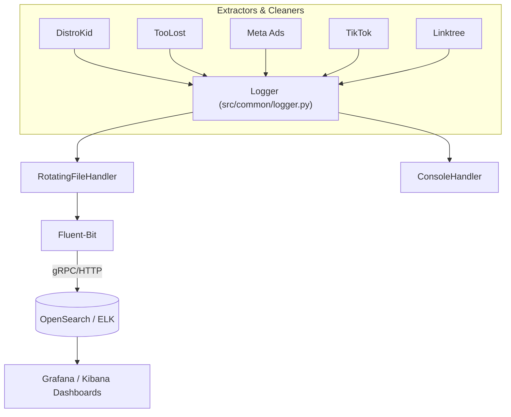
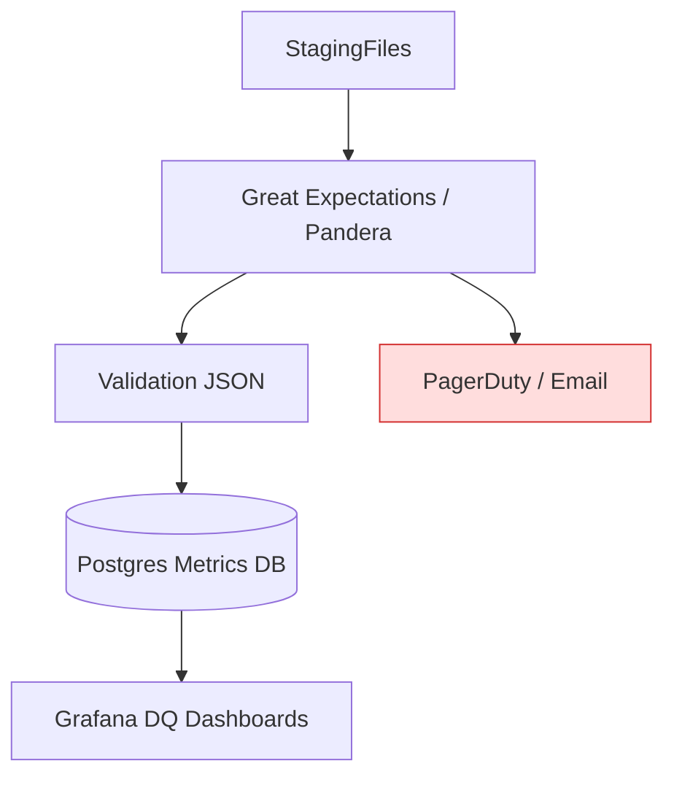
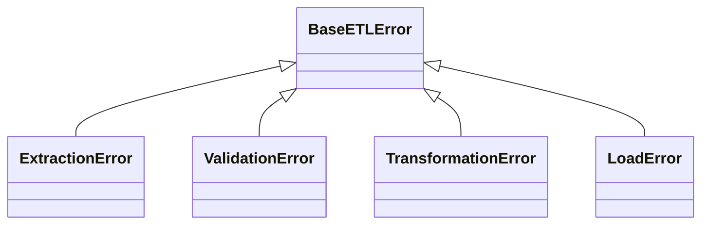

# BEDROT Data Lake – Codebase TODO & Improvement Plan
*Generated: 2025-06-11*

---

## 1. Executive Summary
This document consolidates immediate **bug fixes** and **enhancement goals** gleaned from a quick static audit of the BEDROT Data Lake repository (see `BEDROT_Data_Lake_Analysis.md`, `src/`, `tests/`, and automation scripts).  The focus areas are:

1. Critical bugs & refactors
2. Centralized logging rollout
3. Data-quality metrics pipeline
4. Error-handling & exception-standardization strategy

---

## 2. Critical Bug Fixes / Refactors
| # | Area | Symptom / Evidence | Task |
|---|------|-------------------|------|
| **B-1** | `PROJECT_ROOT` resolution | `metaads_*` cleaners call `Path(os.getenv("PROJECT_ROOT"))` without a default → raises `TypeError` if env var missing. | Write helper `src/common/paths.py::get_project_root()` with safe default; refactor all scripts to use it. |
| **B-2** | IPython imports in batch scripts | `metaads_raw2staging.py` uses `IPython.display.display` (fails in headless/cron). | Remove IPython dependency; wrap in `if __name__ == "__main__" and is_interactive()` guard or drop call. |
| **B-3** | Hard-coded output paths | Some extractors (e.g. TikTok, Linktree) build landing / raw paths manually. | Centralize via `paths.py` helpers (`get_zone_path(zone, source)` ), ensure ENV override. |
| **B-4** | Mixed `print()` vs `logging` | Only `dk_auth.py` uses `logging`; others rely on prints. | Replace prints with logger calls once centralized logging is implemented. |
| **B-5** | TODO/FIX flags | `src/toolost/extractors/toolost_scraper.py` still contains `# FIX:` comment for path cleanup. | Verify path is now correct; remove comment or refactor accordingly. |
| **B-6** | Unit-test placeholders | `tests/*/test_placeholder.py` empty; limited real assertions. | Flesh out coverage for at least one happy-path & one failure case per extractor / cleaner. |
| **B-7** | README gaps per extractor / cleaner | Not urgent (by project convention) but onboarding pain-point. | Add minimal **Usage** & **Env-Vars** section to each sub-package README. |

> **Definition of Done:** CI passes, no runtime exceptions in cron, tests reach 70 %+ line coverage.

---

## 3. Centralized Logging Roll-out
Current state: *only* `distrokid/dk_auth.py` configures `logging.basicConfig`; rest rely on stdout prints.

### 3.1 Proposed Architecture

### 3.2 Implementation Steps
1. Create `src/common/logger.py` that:
   * Reads `LOG_LEVEL` & `LOG_DIR` env vars
   * Configures formatter `[timestamp] [level] [module] – message`
   * Adds `RotatingFileHandler` per module (10 MB / 5 backups).
2. Remove individual `basicConfig` calls; import shared logger via `from common.logger import get_logger`.
3. Write minimal `fluent-bit` Docker config (`/minio/logging/`) to ship files to local OpenSearch.
4. Add Grafana dashboards for **ETL Duration** & **Error Count**.

---

## 4. Data-Quality Metrics Pipeline
Presently, validators exist but no persistent metrics.

### 4.1 Target Design

### 4.2 Tasks
1. Introduce `great_expectations/` project scoped to **staging** zone CSV outputs.
2. Generate data-set-level metrics: row counts, null %, schema drift.
3. Persist `expectation_suite_result` summary to Postgres table `dq_run_history` (or parquet in `knowledge/metrics`).
4. Add CI step to run `great_expectations checkpoint run` on PRs touching cleaners.

---

## 5. Error-Handling Standardization
Inconsistent try/except patterns → silent failures.

### 5.1 Error Taxonomy

### 5.2 Action Plan
1. Add `src/common/errors.py` containing taxonomy above.
2. Replace bare `except Exception` blocks with specific raises.
3. In `main()` entrypoints, wrap entire workflow in one outer try/except that logs & re-raises.
4. Emit **structured log**: `{ "event":"error", "type":"ExtractionError", "msg":..., "trace":... }` for SIEM parsing.

---

## 6. Roadmap & Milestones
| Week | Deliverable |
|------|-------------|
| W24-2025 | B-1..B-3 bug fixes, `common.paths`, initial tests (coverage ≥35 %) |
| W25-2025 | Centralized logging MVP (file + console); migrate DistroKid & TooLost scripts |
| W26-2025 | Fluent-Bit → OpenSearch + dashboards; remaining extractors migrated |
| W27-2025 | `great_expectations` POC on `tidy_metaads.csv` & `tidy_toolost.csv` |
| W28-2025 | Error taxonomy adoption across all cleaners; raise & propagate |
| W29-2025 | CI integration of DQ checks & `pytest --cov` (target 70 %) |

---

## 7. Upcoming Service Integrations
| ID | Service | Scope | Task |
|----|---------|-------|------|
| **S-1** | Spotify for Artists | Extractor / Cleaner | • Scaffold Playwright extractor template   • Create `spotify_landing2raw.py`, `spotify_raw2staging.py`, `spotify_staging2curated.py`   • Add entries to `run_datalake_cron.bat` |
| **S-2** | Mailchimp | API Collector / Cleaner | • Generate OAuth token loader   • Draft campaign-level landing fetcher   • Cleaner scripts mirroring Linktree pattern |
| **S-3** | Instagram | GraphQL Scraper | • Investigate Meta Graph API quotas   • Scaffold extractor   • Implement analytics cleaner |
| **S-4** | YouTube Studio | Analytics API | • Enable YouTube Data API v3 creds   • Extractor for daily video metrics   • Cleaner scripts   • Append to cron |

<small>*Folders for all four services (`landing`/`raw`/`staging`/`curated` + `src/<service>` sub-structure) were created on **2025-06-13**.  Next steps are code scaffolds & credential management.*</small>

---

## 8. References
* `Service_Integration_Guide.md` (naming & directory conventions)
* `BEDROT_Data_Lake_Analysis.md` (architecture diagrams)
* `README.md` (folder semantics)
* `CHANGELOG.md` (historical context)

> *Keep this TODO list up-to-date; close items via PRs referencing the IDs above (e.g., `Fixes B-2`).*
