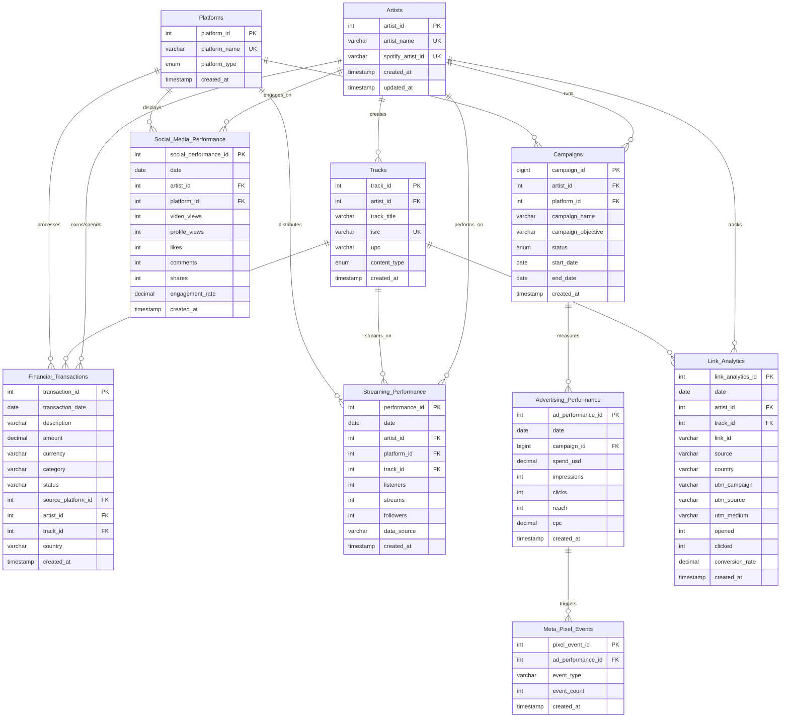

# BEDROT Data Lake - Relational Database Design (3NF)

## Executive Summary

This report presents a normalized relational database schema design based on the curated CSV data from the BEDROT Productions data lake. The schema follows Third Normal Form (3NF) principles to eliminate redundancy, ensure data integrity, and optimize for analytical queries across music streaming, social media, advertising, and financial data.

## Data Source Analysis

### CSV Files Analyzed (13 files, 12,894 total records):
- **Financial**: Capitol One purchases (329 records)
- **Music Distribution**: DistroKid bank details (8,877 records), Daily streams (406 records)
- **Streaming Platforms**: Spotify audience data (1,801 records)
- **Social Media**: TikTok analytics (766 records), Linktree analytics (381 records)
- **Advertising**: Meta Ads campaigns (75 + 78 records)
- **Promotion**: SubmitHub link analytics (5 files, 181 total records)

## Core Business Entities Identified

1. **Artists**: Musical entities (PIG1987, ZONE A0, etc.)
2. **Tracks/Albums**: Musical content with unique identifiers
3. **Platforms**: Distribution/streaming services (Spotify, Apple Music, TikTok, etc.)
4. **Campaigns**: Marketing/advertising initiatives
5. **Financial Transactions**: Purchase and earnings records
6. **Time Series Data**: Daily performance metrics

## Entity Relationship Diagram



## Normalized Database Schema (3NF)

### 1. Artists Table
**Primary Entity**: Musical artists and their metadata

| Column | Type | Constraints | Description |
|--------|------|-------------|-------------|
| artist_id | INT | PRIMARY KEY, AUTO_INCREMENT | Unique artist identifier |
| artist_name | VARCHAR(100) | NOT NULL, UNIQUE | Artist stage name |
| spotify_artist_id | VARCHAR(50) | UNIQUE | Spotify internal ID |
| created_at | TIMESTAMP | DEFAULT CURRENT_TIMESTAMP | Record creation |
| updated_at | TIMESTAMP | ON UPDATE CURRENT_TIMESTAMP | Last modification |

**Sample Data**: pig1987, ZONE A0, ZONE A0 & Sxnctuary

### 2. Tracks Table
**Primary Entity**: Musical tracks and albums

| Column | Type | Constraints | Description |
|--------|------|-------------|-------------|
| track_id | INT | PRIMARY KEY, AUTO_INCREMENT | Unique track identifier |
| artist_id | INT | NOT NULL, FOREIGN KEY → Artists(artist_id) | Track owner |
| track_title | VARCHAR(200) | NOT NULL | Track/album name |
| isrc | VARCHAR(20) | UNIQUE | International Standard Recording Code |
| upc | VARCHAR(20) | | Universal Product Code |
| content_type | ENUM('Song', 'Album') | NOT NULL | Content classification |
| created_at | TIMESTAMP | DEFAULT CURRENT_TIMESTAMP | Record creation |

**Sample Data**: DYSMORPHIA, THE STATE OF THE WORLD, HOLD ON I, ANOVUS

### 3. Platforms Table
**Primary Entity**: Distribution and streaming platforms

| Column | Type | Constraints | Description |
|--------|------|-------------|-------------|
| platform_id | INT | PRIMARY KEY, AUTO_INCREMENT | Unique platform identifier |
| platform_name | VARCHAR(100) | NOT NULL, UNIQUE | Platform name |
| platform_type | ENUM('Streaming', 'Social', 'Distribution', 'Advertising', 'Analytics') | NOT NULL | Platform category |
| created_at | TIMESTAMP | DEFAULT CURRENT_TIMESTAMP | Record creation |

**Sample Data**: Spotify, Apple Music, TikTok, YouTube, Meta Ads, DistroKid

### 4. Campaigns Table
**Primary Entity**: Marketing and advertising campaigns

| Column | Type | Constraints | Description |
|--------|------|-------------|-------------|
| campaign_id | BIGINT | PRIMARY KEY | Platform campaign ID |
| artist_id | INT | NOT NULL, FOREIGN KEY → Artists(artist_id) | Campaign owner |
| platform_id | INT | NOT NULL, FOREIGN KEY → Platforms(platform_id) | Advertising platform |
| campaign_name | VARCHAR(300) | NOT NULL | Campaign title |
| campaign_objective | VARCHAR(100) | | Campaign goal |
| status | ENUM('ACTIVE', 'PAUSED', 'COMPLETED') | NOT NULL | Current state |
| start_date | DATE | | Campaign start |
| end_date | DATE | | Campaign end |
| created_at | TIMESTAMP | DEFAULT CURRENT_TIMESTAMP | Record creation |

### 5. Financial_Transactions Table
**Primary Entity**: All financial records (purchases, earnings, payments)

| Column | Type | Constraints | Description |
|--------|------|-------------|-------------|
| transaction_id | INT | PRIMARY KEY, AUTO_INCREMENT | Unique transaction identifier |
| transaction_date | DATE | NOT NULL | Transaction date |
| description | VARCHAR(500) | NOT NULL | Transaction description |
| amount | DECIMAL(15,2) | NOT NULL | Amount (positive = income, negative = expense) |
| currency | VARCHAR(3) | DEFAULT 'USD' | Currency code |
| category | VARCHAR(100) | | Transaction category |
| status | VARCHAR(50) | | Transaction status |
| source_platform_id | INT | FOREIGN KEY → Platforms(platform_id) | Source platform |
| artist_id | INT | FOREIGN KEY → Artists(artist_id) | Related artist |
| track_id | INT | FOREIGN KEY → Tracks(track_id) | Related track |
| country | VARCHAR(2) | | Country code |
| created_at | TIMESTAMP | DEFAULT CURRENT_TIMESTAMP | Record creation |

### 6. Streaming_Performance Table
**Primary Entity**: Daily streaming and audience metrics

| Column | Type | Constraints | Description |
|--------|------|-------------|-------------|
| performance_id | INT | PRIMARY KEY, AUTO_INCREMENT | Unique performance record |
| date | DATE | NOT NULL | Performance date |
| artist_id | INT | NOT NULL, FOREIGN KEY → Artists(artist_id) | Artist |
| platform_id | INT | NOT NULL, FOREIGN KEY → Platforms(platform_id) | Streaming platform |
| track_id | INT | FOREIGN KEY → Tracks(track_id) | Specific track (nullable) |
| listeners | INT | DEFAULT 0 | Unique listeners |
| streams | INT | DEFAULT 0 | Total streams |
| followers | INT | DEFAULT 0 | Total followers |
| data_source | VARCHAR(100) | | Source system |
| created_at | TIMESTAMP | DEFAULT CURRENT_TIMESTAMP | Record creation |

**Composite Index**: (date, artist_id, platform_id) for time-series queries

### 7. Social_Media_Performance Table
**Primary Entity**: Social media engagement metrics

| Column | Type | Constraints | Description |
|--------|------|-------------|-------------|
| social_performance_id | INT | PRIMARY KEY, AUTO_INCREMENT | Unique record identifier |
| date | DATE | NOT NULL | Performance date |
| artist_id | INT | NOT NULL, FOREIGN KEY → Artists(artist_id) | Artist |
| platform_id | INT | NOT NULL, FOREIGN KEY → Platforms(platform_id) | Social platform |
| video_views | INT | DEFAULT 0 | Video view count |
| profile_views | INT | DEFAULT 0 | Profile view count |
| likes | INT | DEFAULT 0 | Like count |
| comments | INT | DEFAULT 0 | Comment count |
| shares | INT | DEFAULT 0 | Share count |
| engagement_rate | DECIMAL(5,2) | DEFAULT 0.00 | Calculated engagement rate |
| created_at | TIMESTAMP | DEFAULT CURRENT_TIMESTAMP | Record creation |

### 8. Advertising_Performance Table
**Primary Entity**: Daily advertising campaign performance

| Column | Type | Constraints | Description |
|--------|------|-------------|-------------|
| ad_performance_id | INT | PRIMARY KEY, AUTO_INCREMENT | Unique record identifier |
| date | DATE | NOT NULL | Performance date |
| campaign_id | BIGINT | NOT NULL, FOREIGN KEY → Campaigns(campaign_id) | Campaign reference |
| spend_usd | DECIMAL(10,2) | DEFAULT 0.00 | Daily spend |
| impressions | INT | DEFAULT 0 | Ad impressions |
| clicks | INT | DEFAULT 0 | Click count |
| reach | INT | DEFAULT 0 | Unique reach |
| cpc | DECIMAL(6,4) | DEFAULT 0.0000 | Cost per click |
| created_at | TIMESTAMP | DEFAULT CURRENT_TIMESTAMP | Record creation |

### 9. Link_Analytics Table
**Primary Entity**: Link tracking and conversion data

| Column | Type | Constraints | Description |
|--------|------|-------------|-------------|
| link_analytics_id | INT | PRIMARY KEY, AUTO_INCREMENT | Unique record identifier |
| date | DATE | NOT NULL | Analytics date |
| artist_id | INT | NOT NULL, FOREIGN KEY → Artists(artist_id) | Artist |
| track_id | INT | FOREIGN KEY → Tracks(track_id) | Related track |
| link_id | VARCHAR(100) | NOT NULL | Link identifier |
| source | VARCHAR(100) | | Traffic source |
| country | VARCHAR(2) | | Country code |
| utm_campaign | VARCHAR(200) | | UTM campaign |
| utm_source | VARCHAR(100) | | UTM source |
| utm_medium | VARCHAR(100) | | UTM medium |
| opened | INT | DEFAULT 0 | Link opens |
| clicked | INT | DEFAULT 0 | Link clicks |
| conversion_rate | DECIMAL(5,2) | DEFAULT 0.00 | Conversion percentage |
| created_at | TIMESTAMP | DEFAULT CURRENT_TIMESTAMP | Record creation |

### 10. Meta_Pixel_Events Table
**Primary Entity**: Meta advertising pixel events (normalized from JSON)

| Column | Type | Constraints | Description |
|--------|------|-------------|-------------|
| pixel_event_id | INT | PRIMARY KEY, AUTO_INCREMENT | Unique event identifier |
| ad_performance_id | INT | NOT NULL, FOREIGN KEY → Advertising_Performance(ad_performance_id) | Performance reference |
| event_type | VARCHAR(100) | NOT NULL | Pixel event type |
| event_count | INT | NOT NULL | Event occurrence count |
| created_at | TIMESTAMP | DEFAULT CURRENT_TIMESTAMP | Record creation |

**Sample Event Types**: ViewContent, LinkClick, PostEngagement, page_engagement

## Normalization Analysis

### First Normal Form (1NF)
✅ **Achieved**: All tables have atomic values, no repeating groups
- Original JSON pixel events normalized to separate Meta_Pixel_Events table
- Complex targeting data abstracted to maintain atomicity

### Second Normal Form (2NF)
✅ **Achieved**: All non-key attributes fully depend on primary keys
- Performance tables depend on composite natural keys (date + entity IDs)
- Financial transactions normalized by removing partial dependencies

### Third Normal Form (3NF)
✅ **Achieved**: No transitive dependencies
- Artist names separated from performance data
- Platform information centralized to eliminate redundancy
- Campaign metadata isolated from daily performance metrics

## Key Relationships

### Primary Relationships
1. **Artists** ← (1:N) → **Tracks**: One artist has many tracks
2. **Artists** ← (1:N) → **Campaigns**: One artist runs many campaigns
3. **Campaigns** ← (1:N) → **Advertising_Performance**: One campaign has many daily records
4. **Artists/Platforms** ← (1:N) → **Streaming_Performance**: Many-to-many through performance table

### Cross-Platform Integration
- **Campaign_ID** links Meta Ads performance to SubmitHub UTM tracking
- **Artist_ID** provides unified view across all platforms
- **Track_ID** connects streaming data to advertising campaigns

## Data Integrity Constraints

### Business Rules
1. **Financial Balance**: SUM(amount) per artist_id must reconcile with platform payments
2. **Campaign Continuity**: end_date >= start_date for all campaigns
3. **Performance Consistency**: streams >= 0, engagement_rate BETWEEN 0 AND 100
4. **Currency Standardization**: All financial amounts normalized to USD

### Referential Integrity
- Cascading updates for artist/track name changes
- Restricted deletes to prevent orphaned performance data
- Foreign key constraints enforce valid platform/artist relationships

## Indexing Strategy

### Performance Optimization
```sql
-- Time-series analysis
CREATE INDEX idx_streaming_date_artist ON Streaming_Performance(date, artist_id);
CREATE INDEX idx_advertising_date_campaign ON Advertising_Performance(date, campaign_id);

-- Cross-platform queries
CREATE INDEX idx_campaigns_artist_platform ON Campaigns(artist_id, platform_id);
CREATE INDEX idx_financial_artist_date ON Financial_Transactions(artist_id, transaction_date);

-- Analytics aggregation
CREATE INDEX idx_link_analytics_artist_date ON Link_Analytics(artist_id, date);
```

## Implementation Considerations

### Data Quality Assumptions
1. **Artist Name Consistency**: Manual curation required for variant spellings (PIG1987 vs pig1987)
2. **Date Format Standardization**: All dates converted to YYYY-MM-DD format
3. **Currency Conversion**: DistroKid earnings converted from original currency to USD
4. **Platform ID Mapping**: Consistent platform identification across data sources

### ETL Process Requirements
1. **Deduplication**: Composite keys prevent duplicate daily records
2. **Data Validation**: Range checks for financial amounts and performance metrics
3. **Historical Data**: Archive tables for maintaining audit trails
4. **Real-time Updates**: Streaming data requires daily batch processing

### Scalability Notes
1. **Partitioning**: Date-based partitioning for performance tables (monthly/yearly)
2. **Archival Strategy**: Move data older than 2 years to cold storage
3. **Query Optimization**: Materialized views for common aggregations

## Future Extensions

### Additional Entities
1. **Playlist_Inclusions**: Track Spotify playlist additions
2. **Collaborations**: Multi-artist track relationships
3. **Geographic_Performance**: Country-specific streaming breakdowns
4. **Device_Analytics**: Mobile vs. desktop performance metrics

### Enhanced Tracking
1. **Attribution Models**: Multi-touch campaign attribution
2. **Customer Journey**: User progression across platforms
3. **Predictive Analytics**: Forecasting tables for trend analysis

## Conclusion

This normalized 3NF schema provides a robust foundation for BEDROT Productions' analytical needs while maintaining data integrity and minimizing redundancy. The design supports cross-platform analysis, financial reconciliation, and campaign performance tracking essential for modern music marketing operations.

**Database Size Estimate**: ~15,000 records initially, growing to ~500,000 records annually
**Implementation Priority**: Core entities first (Artists, Tracks, Platforms), followed by performance tables
**Technology Recommendation**: PostgreSQL for analytical workloads, with potential Apache Airflow integration for ETL automation